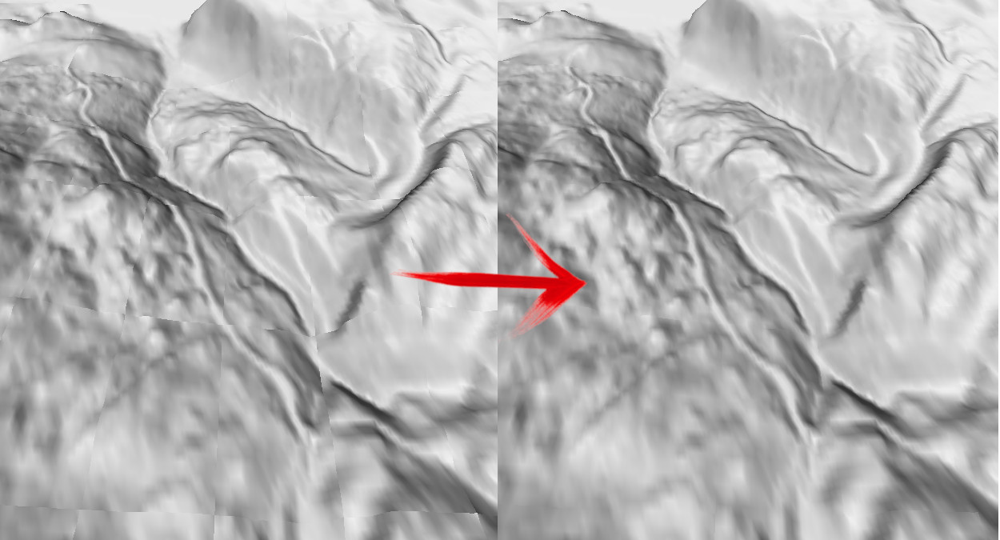
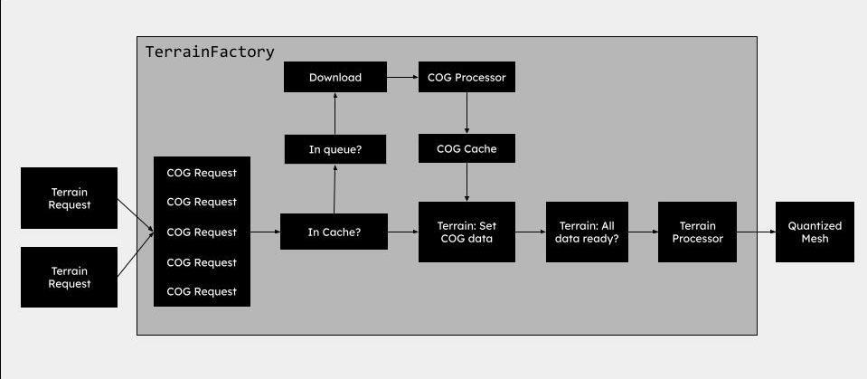

# Cesium Terrain On Demand (CTOD)

CTOD is a service designed to fetch Cesium terrain tiles (quantized mesh) dynamically generated from a Cloud Optimized GeoTIFF (COG). The core concept behind this service is to eliminate the need for creating an extensive cache, thereby saving time and storage space. Traditional caching methods often involve generating and storing numerous files, many of which may never be requested, resulting in unnecessary resource consumption. CTOD addresses this issue by generating terrain tiles on the fly, optimizing efficiency and reducing the burden on file storage.


## TL;DR

```sh
docker run -p 5000:5000 -v ./ctod_cache:/cache -e CTOD_PORT=5000 -CTOD_LOGGING_LEVEL=info -e CTOD_TILE_CACHE_PATH=/cache ghcr.io/sogelink-research/ctod:latest
```

[Open the local running demo viewer](http://localhost:5000)

## Features

- Generate and fetch a layer.json derived from COG, accommodating all projections.
- Retrieve .terrain tiles by tile index, currently supporting grid-based mesh.
- Support for extension octvertexnormals
- Averaging of heights and normals on shared edge vertices among terrain tiles.
- Empty tiles with geodetic surface normals.
- In-memory cache for seamlessly stitching neighboring tiles and preventing redundant requests.
- CogProcessor and TerrainGenerator for diverse terrain serving implementations (Grid, Pydelatin, custom).
- Basic tile caching implementation
- Basic Cesium viewer included for debugging and result visualization.

## ToDo

### V1.0

- Pass processor options
- Add skipCache to viewer
- Test if we can improve performance by reusing readers for the COG (Reader Pool)
- Pydelatin and/or Martini support
- Refactoring
- Cleanup viewer code

### V1.1

- Fill Nodata values on the fly
- Scripts to seed and clean the cache
- Extension support: Metadata, Watermask
- Serverless functions

## Settings

The following options can be set by supplying args to app.py or setting the environment variables.

|argument|environment variable|description|default|
|-|-|-|-|
|--tile-cache-path|CTOD_TILE_CACHE_PATH|Cache dir, not set = cache disabled|None|
|--logging-level|CTOD_LOGGING_LEVEL|debug, info, warning, error, critical|info|
|--port|CTOD_PORT|Port to run the service on|5000|

## Run CTOD

Run CTOD using docker or from source, see `Settings` for configuration options.

### Using Docker

Example running CTOD using the docker image with a mounted volume and caching enabled.

```sh
docker run -p 5000:5000 -v ./ctod_cache:/cache -e CTOD_TILE_CACHE_PATH=/cache ghcr.io/sogelink-research/ctod:latest
```

### From source

Create a virtual environment, install and run CTOD.

```sh
python -m venv venv
source venv/bin/activate
pip install poetry
poetry install
python app.py
```

To enable caching, supply --tile-cache-path path to app.py.

```sh
python app.py --tile-cache-path ./ctod_cache
```

## Example adding TerrainProvider to Cesium

To use the CTOD terrain tiles in Cesium, create and set a `CesiumTerrainProvider` initialized with the url to the CTOD service. The layer.json file will be requested on the /tiles endpoint followed by .terrain requests while passing the options to the endpoints.

```js
viewer.terrainProvider = new Cesium.CesiumTerrainProvider({
    url: `https://ctod-service/tiles?minZoom=1&maxZoom=21&cog=MyCogPath`,
    requestVertexNormals: true
});
```

## Example preparing COG

ToDo

gdalbuildvrt cog_vrt.vrt cog_left.tif cog_right.tif

## Caching

The CTOD service has a very basic tile caching option, tiles can be retrieved and saved by supplying a cache path when starting app.py or setting the environment variable `CTOD_TILE_CACHE_PATH`. Based on this path and the requested cog, meshing method and resampling method a tile can be saved and retrieved from disk. the cog path/url will be encoded into a hex string. When a service is started with caching the cache can be circumvented by adding `ignoreCache=True` to the terrain request.

## Nodata

Nodata values in the COG are automatically set to 0 else it is likely that the meshing will go wrong, for now nodata should be handled in the source data (COG) In a future version we can try to fill up the nodata values based on surrounding pixels.

## Stitching tiles

With all the available methods to generate a mesh for a tiff we are facing the problem that we do not have shared vertices at tile edges as described by the [quantized mesh standard](https://github.com/CesiumGS/quantized-mesh). This results in seems between tiles because of possible height difference but also because the normals are only calculated for a tile and don't take adjecent tiles into account. The seems can be spotted in the left part of the image below. In CTOD we solve this by requesting neighbouring tiles and make sure we have shared vertices and if needed average the height and normals. The terrain factory makes sure we download all needed data without duplicate request, the COG Processor processes the COG data making a mesh and normals, the Terrain Processor makes sure we have have shared edge vertices and the heights and normals are correct on the edges.



*Stitching: Averaged normals between adjecent tiles*

## Used libraries

- [rio-tiler](https://github.com/cogeotiff/rio-tiler): Rasterio plugin to read raster datasets. (BSD-3-Clause)
- [pydelatin](https://github.com/kylebarron/pydelatin): Terrain mesh generation. (MIT)
- [quantized-mesh-encoder](https://github.com/kylebarron/quantized-mesh-encoder): A fast Python Quantized Mesh encoder. (MIT)
- [morecantile](https://github.com/developmentseed/morecantile): Construct and use OGC TileMatrixSets. (MIT)

### TerrainFactory

When requesting neighbouring tiles we want to prevent duplicate requests to the COG, this is handled in the TerrainFactory.

1) Terrain request comes in
2) Spawn cog request for terrain and adjecent tiles for each terrain request
3) Check if Processed COG is in cache, yes -> set cog data in terrain request, no -> add to requests queue if not added yet.
4) Download COG data and process using a COG processor
5) Add data to cache
6) Set COG data for all terrain requests that need this data
7) Check if a terrain requests has all the COG data it needs
8) Run the terrain processor
9) Return Quantized Mesh



### CogProcessor

ToDo

### TerrainProcessor

ToDo

## Endpoints

### Endpoint: `/`

Returns a sample Cesium viewer

#### Request

- **Method:** GET
- **URL:** `http://localhost:5000`

#### Parameters

- **minZoom** : The min zoomlevel for the terrain. Default (0)
- **maxZoom** : The max zoomlevel for the terrain. Default (20)
- **resamplingMethod** : Resampling method for COG: 'nearest', 'bilinear', 'cubic', 'cubic_spline', 'lanczos', 'average', 'mode', 'gauss', 'rms'. Default 'bilinear'
- **cog** (required): Path or URL to COG file.
- **ignoreCache** : Set to true to prevent loading tiles from the cache. Default (False)

#### Example

```sh
http://localhost:5000?minZoom=1&maxZoom=20&cog=./ctod/files/test_cog.tif
```

### Endpoint: `/tiles/layer.json`

Dynamically generates a layer.json based on the COG.

#### Request

- **Method:** GET
- **URL:** `http://localhost:5000/tiles/layer.json`

#### Parameters

- **maxZoom** : The max zoomlevel for the terrain. Default (20)
- **cog** (required): Path or URL to COG file.

#### Example

```sh
http://localhost:5000/tiles/layer.json?maxZoom=20&cog=./ctod/files/test_cog.tif
```

### Endpoint: `/tiles/{z}/{x}/{y}.terrain`

Get a quantized mesh for tile index z, x, y. Set the minZoom value to retrieve empty tiles for zoom levels lower than minZoom. maxZoom is handled in the generated layer.json.

#### Request

- **Method:** GET
- **URL:** `http://localhost:5000/tiles/{z}/{x}/{y}.terrain`

#### Parameters

- **minZoom** : The min zoomlevel for the terrain. Default (0)
- **resamplingMethod** : Resampling method for COG: 'nearest', 'bilinear', 'cubic', 'cubic_spline', 'lanczos', 'average', 'mode', 'gauss', 'rms'. Default 'bilinear'
- **cog** (required): Path or URL to COG file.
- **ignoreCache** : Set to true to prevent loading tiles from the cache. Default (False)

#### Example

```sh
http://localhost:5000/tiles/17/134972/21614.terrain?minZoom=1&cog=./ctod/files/test_cog.tif
```
